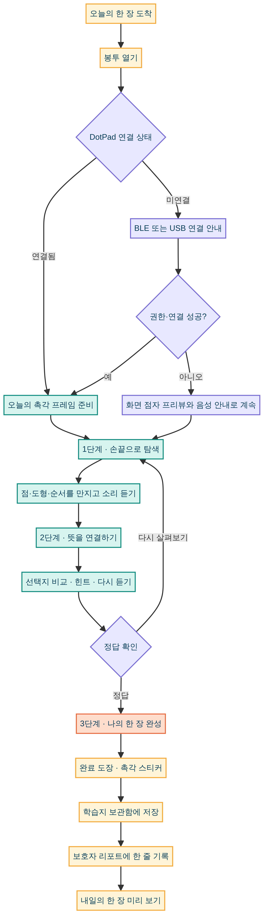

# Sensory 매일 학습지 경험 확장안

## 설계 방향

Sensory의 핵심은 닷패드 연결 자체가 아니라, **매일 한 장의 촉각 학습지가 도착하고 손끝으로 풀어 보며 남기는 작은 성취**다. 제안하는 경험은 `도착 → 열기 → 만지기 → 완성 → 보관 → 내일 기대`의 짧고 반복 가능한 루틴을 만든다. 봉투와 우표는 학습지의 물성을, DotPad는 손끝 탐색의 깊이를, 보관함과 보호자 리포트는 꾸준함의 기록을 담당한다.

| 구간 | 사용자가 느껴야 할 가치 | 대표 인터랙션 | 기록되는 정보 |
|---|---|---|---|
| 도착 | 오늘 나만의 한 장이 왔다 | 봉투 열기 | 요일·학습지 번호 |
| 탐색 | 손끝으로 먼저 이해한다 | DotPad 프레임·다시 듣기 | 탐색 횟수·힌트 여부 |
| 완성 | 작은 성공을 남긴다 | 완료 도장·스티커 | 완료 시각·연속 일수 |
| 회고 | 내가 해 온 한 장들이 보인다 | 보관함·리포트 | 과목·정답·반복 필요 영역 |

## 1. 오늘의 봉투 열기 UI 시안

봉투 열기 화면은 로그인 후 첫 화면 또는 `시작하기`를 눌렀을 때 보여 주는 **하루의 진입 의식**이다. 기존의 3D 해변 장면을 전면에 두고, UI는 종이 라벨·봉투·우표처럼 최소한으로만 올린다. 큰 글자 배경 패널은 사용하지 않으며, 제목은 하늘과 바다의 비교적 비어 있는 안전 영역에 배치한다.

| 요소 | 화면 위치 | 내용 | 동작 및 상태 |
|---|---|---|---|
| 상단 바 | 상단 고정 | `sensory`, 오늘의 날짜, 메뉴 | 메뉴는 학습지 보관함·보호자 리포트로 연결 |
| 도착 라벨 | 제목 위 | `TODAY’S SHEET 03` | 현재 학습지 번호와 요일을 읽어 줌 |
| 봉투 | 화면 중앙 하단 | 크림색 봉투, 6점 우표, 학습지 모서리 | 탭·Enter로 열기, 180–240ms 열림 모션 |
| 한 줄 안내 | 봉투 위 | “손끝으로 오늘의 학습지를 열어 보세요.” | 음성 읽기 시작 전에도 이해 가능한 텍스트 |
| 기본 CTA | 봉투 아래 | `학습지 열기 →` | 봉투 열기와 동일한 다음 단계 진입 |
| 보조 정보 | 하단 안전 영역 | 연속 학습일·내일 미리보기 | 색만으로 상태를 표현하지 않음 |

> **입장 규칙:** 아직 시작하지 않은 날에는 ‘도착’ 상태만, 이어 하던 날에는 ‘이어서 풀기’ 상태만 보여 준다. 한 화면에 두 개의 주요 CTA를 두지 않아 다음 행동을 명확하게 만든다.

## 2. 완료 도장 시스템 UI 시안

완료 화면은 점수판이 아니라 **오늘의 학습지를 우편물처럼 처리해 보관하는 순간**으로 설계한다. 귤색 우표 도장은 ‘완료’만 전달하고, 연속 학습은 압박이 아닌 “3일째 이어가는 손끝의 습관”처럼 차분히 알린다. 다음 학습지를 미리 볼 수 있는 작은 티켓은 보상 뒤에도 내일을 기대하게 만든다.

| 요소 | 역할 | 권장 표현 |
|---|---|---|
| 완료 도장 | 학습 종료를 즉시 인지 | 종이 위 중앙의 귤색 원형 스탬프, `완료` 텍스트와 촉각 6점 모티프 |
| 촉각 스티커 | 누적 성취의 비평가형 보상 | 캐릭터·조개·별·점자 타일 중 하나, `촉각 스티커 +1`로 명확히 안내 |
| 연속 학습 문장 | 꾸준함 격려 | 숫자 중심이 아닌 짧은 문장으로 표시, 연속 기록이 끊겨도 부정적 문구 없음 |
| 내일 티켓 | 다음 방문의 동기 | 다음 과목·캐릭터·한 줄 미션만 공개, 정답이나 학습 내용을 미리 노출하지 않음 |
| 보관 버튼 | 성취의 저장 지점 | `보관함에서 보기`를 보조 CTA로 제공 |

## 3. DotPad를 포함한 촉각 미션 3단계

아래 흐름은 DotPad가 연결되지 않은 경우에도 학습이 멈추지 않되, 연결된 경우에는 촉각 프레임을 우선 경험하도록 설계한 것이다. 브라우저 권한과 실제 기기 전송은 사용자의 Chrome/Chromium 및 DotPad 환경에서 확인해야 한다.

| 단계 | 학습자 화면 | DotPad 연동 | 핵심 동작 | 다음 조건 |
|---|---|---|---|---|
| **1. 손끝으로 탐색** | 점·도형·순서를 한 화면에 하나씩 제시 | 연결 시 60×40 촉각 프레임 전송 | 만져 보기, 다시 듣기, 속도 조절 | “다음” 또는 탐색 완료 |
| **2. 뜻을 연결하기** | 질문과 2–4개의 큰 선택지 | 선택 전·후 동일 프레임 또는 비교 프레임 | 선택지 비교, 힌트, 다시 듣기 | 정답 확인 |
| **3. 나의 한 장 완성** | 완료 도장·한 줄 회고·내일 티켓 | 정답 프레임을 한 번 더 확인 가능 | 스티커 수집, 보관, 보호자 공유 | 보관함 저장 |

DotPad 연결 제어는 **1단계 상단의 보조 도구**로 둔다. ‘블루투스 연결’과 ‘USB 연결’은 명확히 분리하며, 미연결 상태에서는 “화면 점자 프리뷰와 음성으로 계속할 수 있어요”를 함께 표시한다. 전송 실패는 학습 실패와 구분하고, `다시 연결` 및 `화면으로 계속`을 동등한 수준의 선택지로 제공한다.

## 4. 나만의 학습지 보관함

보관함은 ‘학습 기록 목록’보다 **내가 모은 한 장들**이라는 수집 경험을 우선한다. 첫 화면은 날짜별 작은 학습지 표지의 세로 스크롤이고, 개별 항목은 카드가 아니라 실제 종이 한 장처럼 보이게 구성한다.

| 영역 | 구성 | 세부 내용 |
|---|---|---|
| 상단 요약 | 이번 주 수집 현황 | `이번 주 3장`, 연속 학습일, 최근 받은 스티커 한 개 |
| 필터 | 빠른 회고 | 전체·문해·수학·영어·촉각 그림, 완료·다시 만나기 |
| 학습지 목록 | 한 장 단위 세로 스크롤 | 날짜, 캐릭터, 과목, 완료 도장, 1줄 미션, DotPad 프레임 다시 보기 |
| 다시 만나기 | 부담 없는 복습 입구 | 틀린 문제보다 ‘한 번 더 만져 보기’로 표현, 힌트부터 재시작 |
| 수집장 | 스티커 모음 | 스티커 이름·받은 날짜·연결된 학습지, 단순 장식만으로 의미를 만들지 않음 |

모바일에서는 날짜 필터를 가로 스크롤 칩으로 두고, 학습지 목록은 **가운데 정렬된 한 장 폭의 세로 스크롤**을 사용한다. 각 학습지는 넉넉한 터치 영역과 `다시 열기` 버튼을 갖는다.

## 5. 보호자 리포트 화면 구성

보호자 리포트는 성적표가 아니라 **손끝의 학습 흐름을 이해하는 대화용 요약**이어야 한다. 첫 화면에서 숫자를 과도하게 나열하지 않고, 이번 주의 한 줄 요약·학습 리듬·도움이 된 방식·다음 주 제안을 차례대로 제공한다.

| 우선순위 | 섹션 | 화면 내용 | 보호자에게 주는 답 |
|---:|---|---|---|
| 1 | 이번 주 한 줄 | “이번 주 3장의 학습지를 차분히 완성했어요.” | 이번 주는 어땠나? |
| 2 | 학습 리듬 | 요일별 도착·열기·완료 상태를 종이 스탬프로 표현 | 언제 학습했나? |
| 3 | 감각별 반응 | 문해·수학·영어·촉각 그림별 완료·다시 듣기·힌트 사용 | 어떤 방식이 도움이 되었나? |
| 4 | DotPad 사용 맥락 | 연결 성공 여부, 프레임 전송 시도, 미연결 대체 학습 여부 | 기기가 학습에 어떻게 쓰였나? |
| 5 | 다음 주 제안 | “금요일 촉각 그림을 한 번 더 만나 보세요.” | 다음에 무엇을 하면 좋나? |
| 6 | 공유용 한 줄 | 보호자·교사가 복사할 수 있는 중립적 요약 | 어떻게 대화를 시작하나? |

리포트의 색상은 과목 구분을 보조할 뿐, 상태는 `완료`, `이어 하기`, `다시 만나기`라는 텍스트와 도장 형태로 함께 전달한다. 데이터가 충분하지 않을 때는 빈 그래프 대신 “이번 주 첫 장을 열면 여기에서 학습 흐름을 볼 수 있어요”라는 안내를 표시한다.

### 화면 배치 청사진

| 화면 | 상단 25% | 본문 55% | 하단 20% | 모바일 우선 규칙 |
|---|---|---|---|---|
| **학습지 보관함** | `sensory`·이번 주 3장·연속 학습 3일 | 날짜별 학습지 한 장씩의 세로 목록 | 선택한 과목 필터·다시 만나기 | 한 화면에는 가장 최근 학습지 1장만 완전하게 보이도록, 목록을 가운데 정렬한 세로 스크롤로 구성 |
| **학습지 상세** | 날짜·과목·캐릭터·완료 도장 | 문제 요약, DotPad 프레임 다시 보기, 음성 다시 듣기 | `다시 열기`·보관함으로 | 정답 원문보다 ‘어떤 감각을 썼는지’와 ‘다시 만져 보기’를 먼저 노출 |
| **보호자 리포트** | 이번 주 한 줄 요약·완료 장수 | 요일별 스탬프, 과목별 감각 반응, DotPad 사용 맥락 | 다음 주 제안·공유용 한 줄 | 지표 카드를 2열로 압축하지 않고, 한 행 한 질문·한 답 구조로 세로 배치 |

보관함의 상세 화면에는 실시간 기기 연결을 강제하지 않는다. 이미 저장된 학습지의 DotPad 프레임은 `다시 닷패드에 올려 보기`로 별도 요청하게 하며, 미연결 상태에서도 화면 점자 프리뷰와 음성 안내로 회고할 수 있게 한다. 보호자 리포트에는 기기의 **연결 성공 여부**와 **시도 횟수**를 학습 성취와 분리해 표시해, 기기 문제를 학습자의 실패처럼 해석하지 않도록 한다.

## 권장 출시 순서

| 순서 | 기능 묶음 | 이유 |
|---:|---|---|
| 1 | 봉투 열기 + 완료 도장 | 현재 홈·7일 학습지에 가장 적은 변경으로 ‘매일 한 장’ 정체성을 강화 |
| 2 | 촉각 미션 3단계 | DotPad 연결을 학습 흐름 속 자연스러운 보조 도구로 정착 |
| 3 | 학습지 보관함 | 일회성 데모를 누적 경험으로 전환 |
| 4 | 개편된 보호자 리포트 | 보관함의 실제 기록을 바탕으로 유의미한 대화 시작점 제공 |

이 제안은 UI·정보구조 시안이며, 실제 DotPad 전송 성공은 연결된 기기와 Chrome/Chromium 환경에서 별도 검증이 필요하다.

## 산출물 확인

렌더링된 흐름도는 DotPad 연결 성공·실패의 두 경로를 모두 1단계 탐색으로 합류시키고, 정답 확인 뒤 완료 도장·보관·보호자 기록·내일 미리 보기까지의 순서를 명확히 표현한다. 봉투 열기 시안은 전체 화면 3D 파스텔 해변, 크림색 봉투와 6점 모티프, `TODAY’S SHEET 03`, 한국어 도착 안내, 귤색 `학습지 열기` CTA를 포함하며, 큰 어두운 텍스트 패널 없이 안전한 하늘 영역에 주요 문구를 배치했다.

완료 도장 시안은 1080×1920px 세로 화면으로 실제 생성·표시를 확인했다. 크림색 학습지, 6점 모티프, 귤색 `완료` 우표, `3일째 이어가는 손끝의 습관`, `촉각 스티커 +1`, `내일의 한 장 미리 보기` 티켓과 보라색 3D 캐릭터를 동일한 해변형 세계관 안에 배치했다.
